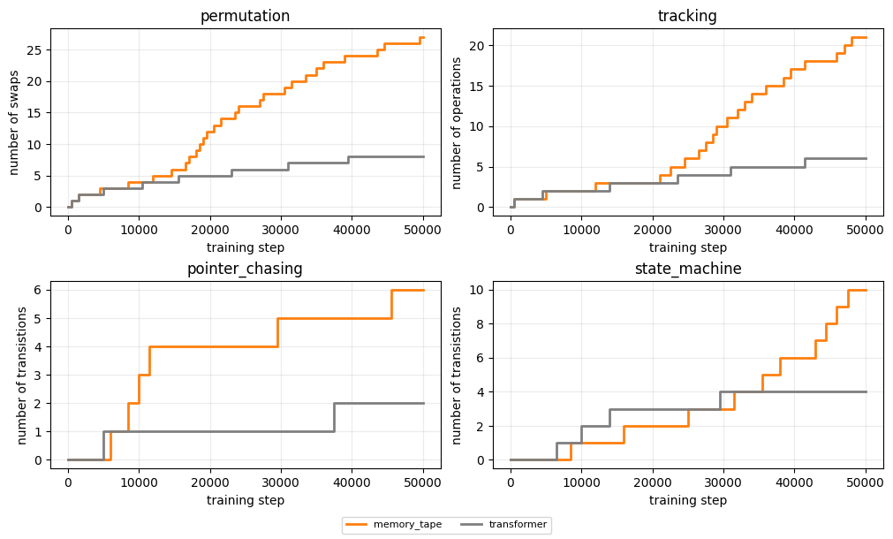
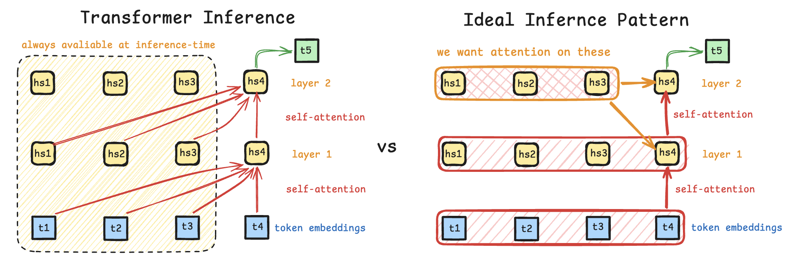
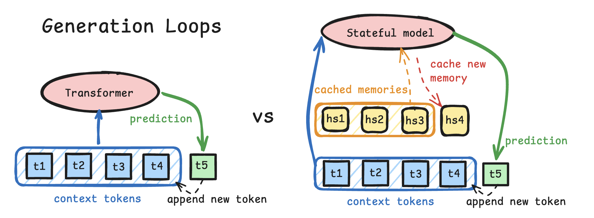
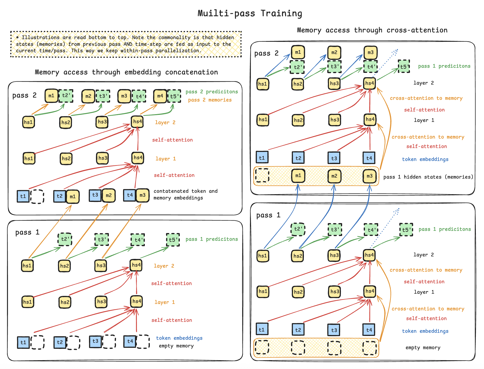
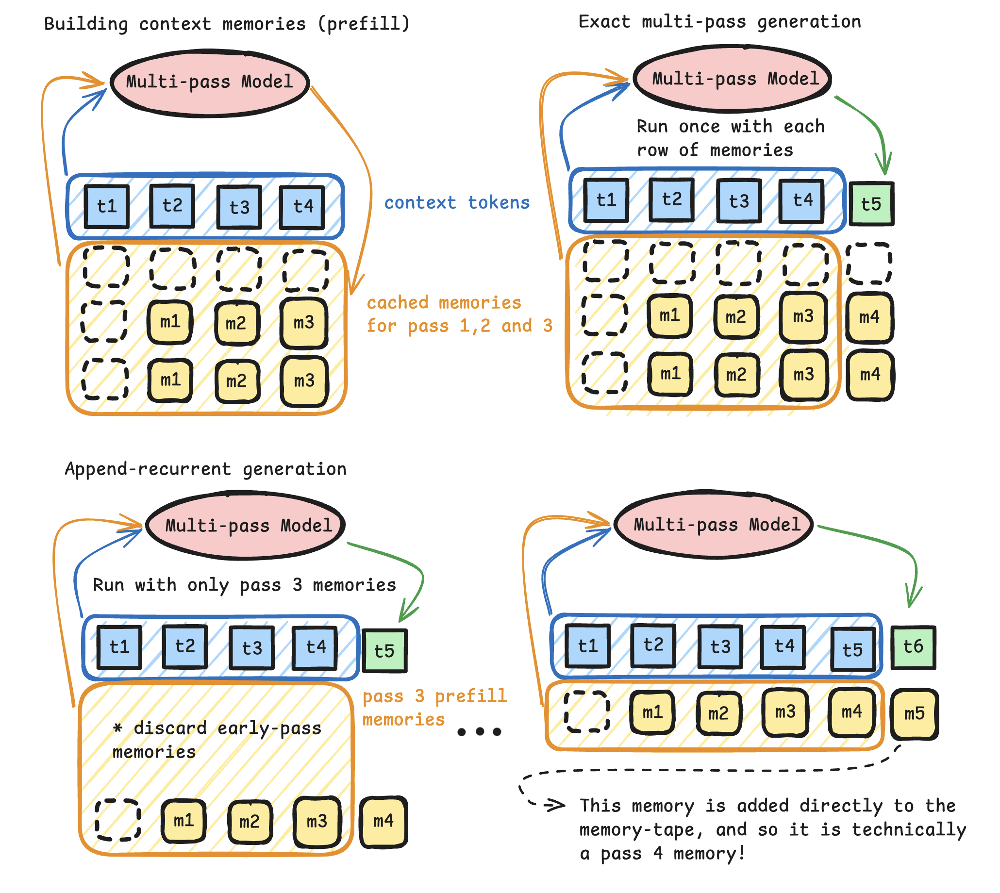
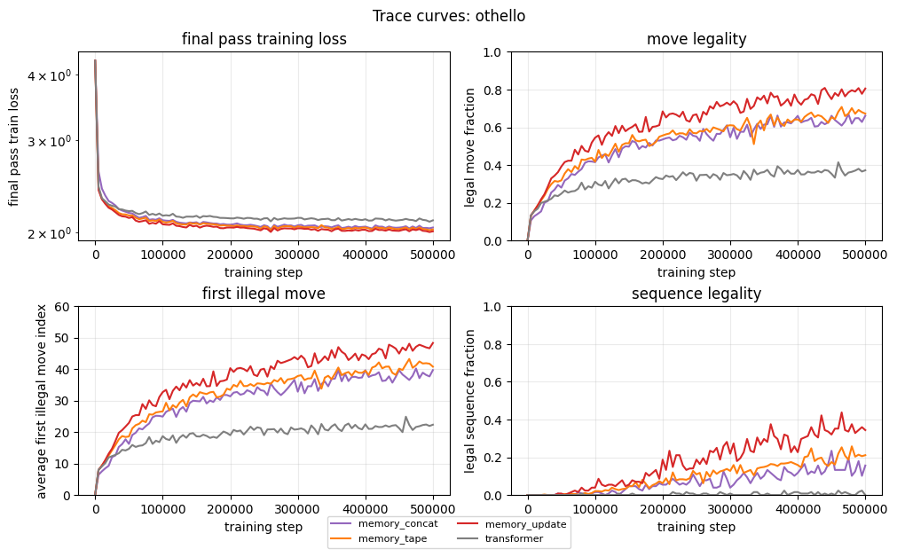

# Multi-Pass Transformer Training

This project explores a way to train transformers for recurrent-style inference without training them as token time recurrent models. The key idea is to train transformers with multiple passes over the same token-sequence. Earlier passes write per-token memory states; later passes read shifted versions of those memories, giving each token access to deep-layer information from previous token positions while preserving parallel training.

## A Motivating Problem: State Tracking

Transformers often struggle with algorithmic state tracking (see, for example, [Li25](https://arxiv.org/abs/2503.02854)), which is why related tasks appear in challenging benchmarks such as BBH (see [Suzgun22](https://arxiv.org/abs/2210.09261)). Here, we use four BBH-inspired tasks to test whether a small transformer can learn to update a symbolic state repeatedly.



The models learn these tasks by tracking an increasing number of state changes. The permutation task, for example, looks like "[A,B,C,D] swap 1 2 [B,A,C,D]". We predict only the final state and increase the number of swaps once validation accuracy exceeds 98%. For these experiments, the baseline transformer and multi-pass models use the `small` preset: 4 layers, 4 attention heads, and 128 embedding dimensions. The baseline is intentionally depth-constrained, while the multi-pass models can reuse a shifted memory tape across recurrent passes. The baseline's learned number of state changes therefore flattens in a way that multi-pass training alleviates.

## A Theoretical Motivation

The training-time parallelization of decoder-only transformers is one of the main reasons they scale so well. At layer $l$, the hidden state $h_i^l$ at position $i$ can attend to positions $h_{j\leq i}^{l-1}$ from layer $l-1$, and not to hidden states from the same or deeper layers. This *causal* attention pattern permits hidden states for all token positions in a layer $[h_{1}^{l}, \ldots, h_{n}^l]$ to be computed in parallel during training, but it also disallows attention to previous tokens' deeper-layer hidden states at inference time.

This information flow gives the model no learned latent state independent of the token prefix. Without a KV cache, each generation step recomputes the prefix. A KV cache is runtime state that avoids this repeated computation, but it is functionally determined by the token prefix and does not carry information that a full-prefix evaluation would not reconstruct.



The tempting 'fix' would be to let the hidden state $h_{i}^{l}$ at token $i$ depend directly on the hidden state $h_{j}^{\ell}$ at token $j<i$ in the same or deeper layers $\ell \geq l$. But that would introduce a token-time recurrence: position $i$ would have to wait for position $i-1$, and the training-time parallelism would be lost.



But here is an idea: what if we run multiple sequential passes over the same teacher-forced sequence instead of making token $i$ wait for token $i-1$ during training? Token positions remain parallel within each pass, while the passes themselves form a recurrence. Pass 1 writes a memory tape. Pass 2 reads a shifted version of that tape. Pass 3 can read the shifted tape from pass 2, and so on. The hope is that such multi-pass training can teach the model to emit memories that are useful and stable enough to support cheaper recurrent-style memory use at inference time.

### Setup

The goal is not merely to cache attention keys and values. The goal is to train the model to read and write a memory state for each token, and then test whether those memories can be reused during generation. There are many possible memory designs. This project focuses on one memory vector per token per pass.

For a token sequence $T = [t_0, \ldots, t_{n-1}]$, let $M^{(k)}$ be the length-$n$ memory tape written after pass $k$. The all-zero tape is the initial state $M^{(0)} = 0$, and the multi-pass recurrence is:

```math
(L^{(k)}, M^{(k)})
= F_\theta\left(T, \mathrm{Shift}(M^{(k-1)})\right),
\qquad k = 1, \ldots, K
```

Here $L^{(k)}$ is the pass-$k$ logit tensor. $F_\theta$ is schematic: an architecture may write memory from any internal representation, not necessarily its final hidden state. The causal constraint is that position $t$ may read only memories written at earlier positions. In a parallel batch, that is implemented by a one-position shift:

```math
\mathrm{Shift}(M)[0] = 0
\qquad
\mathrm{Shift}(M)[t] = M[t - 1]
\quad \text{for } 1 \le t < n
```

That keeps the training computation parallel over token positions while giving each pass access to information written by the previous pass.

## Multi-pass Training

Multi-pass training runs the same teacher-forced sequence through the model several times. The recurrence is over the pass dimension, not over token time. That distinction is the trick; within each pass, all token positions are still computed in parallel, as in an ordinary transformer.

Perhaps the easiest way to illustrate this is to imagine using a transformed last-layer hidden state as the memory. That memory can be fed back into the next pass in different ways, for example by concatenating it to the input stream or by reading it through a separate causal cross-attention path.



The $K$-pass training loop is:

> $`M^{(0)} = 0`$<br>
> $`\mathcal{L} = 0`$<br>
> $`\textbf{for } k = 1, \ldots, K:`$<br>
> &nbsp;&nbsp; $`R = \mathrm{Shift}(M^{(k-1)})`$<br>
> &nbsp;&nbsp; $`H = \mathrm{ArchitectureDecoder}(T, R)`$<br>
> &nbsp;&nbsp; $`L^{(k)} = \mathrm{LMHead}(H)`$<br>
> &nbsp;&nbsp; $`M^{(k)} = \mathrm{MemoryWriter}(H)`$<br>
> &nbsp;&nbsp; $`\mathcal{L} = \mathcal{L} + w_k\,\mathrm{LMLoss}(L^{(k)}, Y)`$

Most experiments put the heaviest weight on the final pass. The final pass is therefore trained to do the main predictive work, while earlier passes are encouraged to write memories that make later predictions easier.

The training schema:

1. pass `k` reads the shifted memory tape written by pass `k - 1`
2. pass `k` predicts the same next-token targets as the other passes
3. pass `k` writes a new memory tape for pass `k + 1`

is exact with respect to this `K`-pass model. No approximation has been introduced yet.

## Mismatch and Append-Recurrent Inference

And how do we get stateful inference out of this? Well, the exact inference procedure for this model is expensive. For every new token, we can run all $K$ passes on the full current prefix. That exact `recompute` procedure preserves the same pass-by-pass recurrence used in training, but it is too expensive for the target inference mode. What we want is append-recurrent inference:

1. Run the prompt exactly for $K$ passes.
2. Cache the final prompt memory tape $M_{\mathrm{prompt}}^{(K)}$.
3. Generate the first token from the final prompt logits.
4. Run one pass over the extended prefix using the persistent memory cache.
5. Append only the memory written for the newest token.
6. Repeat without rewriting the older cached memories.



The first generated token is special. After the $K$ prompt passes, the model already has both the final logits for predicting the next token and the final prompt tape $M_{\mathrm{prompt}}^{(K)}$. So no extra recurrent pass is needed to sample the first token. Once $t_{n+1}$ has been generated, the model runs one pass over the extended prefix while reading the persistent prompt tape. It keeps the old entries fixed and appends the newly written memory for the generated token:

```math
\mathrm{Append}\left(M_{\mathrm{prompt}}^{(K)}, \widetilde M_{\mathrm{new}}\right)
```

The next generated token is then produced from a tape containing both final-pass prompt memories and a memory written by the online recurrent procedure. Each following step appends one more such memory. That is the approximation. Exact recomputation would rerun all $K$ passes on the longer prefix. Causality means that the prompt positions would be reconstructed identically, but the new position would be processed through the full sequence of $K$ pass updates. Append-recurrent inference reuses the final prompt tape and gives the new position only one online recurrent update before appending its memory. The project therefore depends on a stability question:

> Does multi-pass training produce final-pass memories that remain useful when they are frozen and extended recurrently with newly generated memories?

If yes, generation can pay for the $K$-pass computation once on the prompt and then continue with one pass per generated token. If no, the recurrent tape drifts away from the finite-pass model. The real empirical question is the gap between `recompute` and `append_recurrent` generation, especially as the generated suffix becomes longer.

## Experiments

### Long-Range Trace Tasks

Okay, but the state-tracking tasks introduced earlier had only a few tokens to predict. Is this not a cherry-picked set of tasks that avoids the mismatch problem?

Yes, partly. The BBH curriculum tasks isolate whether the model can learn repeated state updates without trace supervision, but final-answer-only supervision does not stress test append-recurrent generation over a long suffix. The mismatch problem only becomes unavoidable when the model has to keep generating after the prompt and repeatedly feed its own recurrent memory cache forward.

That is why the repo also includes longer-range trace tasks. These are fixed-trace generation problems where the model must emit a long legal suffix after the prompt, so `recompute` versus `append_recurrent` evaluation becomes a real test of recurrent stability. One motivation is the world model studied in [OthelloGPT](https://arxiv.org/pdf/2309.00941), an eight-layer GPT-2-style model trained to predict legal sequences of [Othello](https://www.eothello.com/) moves. Because move legality depends on the evolving board state, the model must learn an implicit form of board-state tracking. Most Othello games last about 60 moves, making legal continuation a useful long-range state-tracking task.



In the plot above, all three plotted multi-pass variants outperform the transformer by a large margin. JointMemoryTape was added later and is not represented in this figure. The plotted models have around 1 million parameters, roughly $20$ times fewer than OthelloGPT. These results suggest that the plotted multi-pass models can generate reasonably accurately, but the refreshed implementations—including JointMemoryTape—still need direct evaluation under both `recompute` and `append_recurrent` to measure recurrent drift.

## Multi-pass Architectures

The following architectures explore some different ways of passing on the memories between passes. They all follow the abstract multi-pass training and inference-time methods (see the parent-class `MultiPassTransformer` in the codebase).

The notation in this section is deliberately tensor-level: $X$ is the token-embedding stream, $M^{(k)}$ is the full tape written at pass $k$, and $R = \mathrm{Shift}(M^{(k-1)})$ is the tape read at the next pass. The shared multi-pass wrapper performs the shift, final normalization, language-model head, and memory write; each variant below defines only its decoder, which maps $(X, R)$ to the pre-final hidden stream. The equations use standard attention categories—causal self-attention and causal cross-attention—and spell out the less standard two-source construction used by JointMemoryTape.

### Memory Through Attention: The MemoryTape Architecture

MemoryTape retains an ordinary causal token decoder. Its decoder is:

> **MemoryTape decoder**
>
> $`H = X`$<br>
> $`\textbf{for each decoder block:}`$<br>
> &nbsp;&nbsp; $`H = H + \mathrm{CausalSelfAttention}(\mathrm{LN}_{\mathrm{self}}(H))`$<br>
> &nbsp;&nbsp; $`H = H + \gamma\,\mathrm{CausalCrossAttention}\left(Q=\mathrm{LN}_{q}(H),\ KV=\mathrm{LN}_{kv}(R)\right)`$<br>
> &nbsp;&nbsp; $`H = H + \mathrm{MLP}(\mathrm{LN}_{\mathrm{mlp}}(H))`$<br>

Causal cross-attention is applied over $R$ as a separately addressable key/value source; the tape is not concatenated with the token stream. Its inclusive causal mask permits query position $t$ to read tape slots $s\leq t$. Because $R_s=M_{s-1}$, this is strict causality with respect to the unshifted tape: only memories from original positions before $t$ are readable. Each layer has a learned scalar $\gamma$, initialized to `0.1`. On pass one, $R=0$, so the cross-attention contribution is exactly zero and the model begins as a causal token decoder.

### Causal Attention over Token and Memory Sources: The JointMemoryTape Architecture

JointMemoryTape retains the same token working stream, shifted read-only tape, and shared memory writer, but replaces the separate token self-attention and memory cross-attention distributions with one causal multi-source attention distribution. For each attention head $a$:

```math
\begin{aligned}
Q_a &= \mathrm{LN}_{q}(H)\,W^Q_a, \\
K_a &= \operatorname{Concat}_{\mathrm{source}}\!\left(
\mathrm{LN}_{\mathrm{tok}}(H)\,W^{K,\mathrm{tok}}_a,
\mathrm{LN}_{\mathrm{mem}}(R)\,W^{K,\mathrm{mem}}_a
\right), \\
V_a &= \operatorname{Concat}_{\mathrm{source}}\!\left(
\mathrm{LN}_{\mathrm{tok}}(H)\,W^{V,\mathrm{tok}}_a,
\mathrm{LN}_{\mathrm{mem}}(R)\,W^{V,\mathrm{mem}}_a
\right).
\end{aligned}
```

Both source banks use the same causal source mask:

```math
A_{t,(b,s)} =
\begin{cases}
0 & s \leq t, \\
-\infty & s > t,
\end{cases}
\qquad b \in \{\mathrm{tok},\mathrm{mem}\}.
```

The block then applies ordinary scaled dot-product attention and the standard multi-head output projection:

```math
D_a = \operatorname{softmax}\!\left(\frac{Q_aK_a^\top}{\sqrt{d_h}} + A\right)V_a,
\qquad
D = \operatorname{Concat}_{\mathrm{head}}(D_1,\ldots,D_m)\,W^O.
```

> **JointMemoryTape decoder**
>
> $`H = X`$<br>
> $`\textbf{for each decoder block:}`$<br>
> &nbsp;&nbsp; $`H = H + D \qquad \text{using the causal two-source attention defined above}`$<br>
> &nbsp;&nbsp; $`H = H + \mathrm{MLP}(\mathrm{LN}_{\mathrm{mlp}}(H))`$<br>

The token and shifted-memory banks have separate key/value projections but compete within the same softmax. The tape has the same sequence length as the token stream, with $R_t=M_{t-1}$, and no additional positional embedding is applied to it. Unlike MemoryTape, there is no memory gate. When $R=0$ on pass one, the bias-free memory projections produce zero keys and values, but the null memory slots still occupy probability mass in the shared softmax. This deliberate first-pass dilution means JointMemoryTape is an architecture variant, not a one-variable ablation of MemoryTape: it also changes the residual structure, parameter count, and initialization-time token-attention behavior.

### Memory Through Embedding Concatenation: The MemoryConcat Architecture

MemoryConcat removes the separate memory reader. Its decoder is:

> **MemoryConcat decoder**
>
> $`H = W_{\mathrm{fuse}}\left(\mathrm{Concat}(X, \mathrm{LN}_{\mathrm{mem}}(R))\right)`$<br>
> $`\textbf{for each causal decoder block:}`$<br>
> &nbsp;&nbsp; $`H = \mathrm{DecoderBlock}(H)`$<br>

The token stream remains the main object transformed by the decoder. Memory is an aligned input feature, not an independently addressable source. This is the direct ablation for whether a recurrent signal helps at all, versus whether MemoryTape specifically benefits from content-addressed reads. The implementation initializes the fusion projection so the token half starts near an identity map and the memory half starts small. This keeps the initial model close to a normal transformer while allowing training to learn how much memory to use.

### Memory-First Working Stream: The MemoryUpdate Architecture

MemoryUpdate tests a different inductive bias. Instead of transforming a token stream and writing memory afterward, its decoder makes a memory-derived state stream $S$ the object transformed by the blocks:

> **MemoryUpdate decoder**
>
> $`S = \mathrm{LN}_{\mathrm{mem\_in}}(R) + W_{\mathrm{token\to mem}}\mathrm{LN}_{\mathrm{token\_in}}(X)`$<br>
> $`\textbf{for each memory-update block:}`$<br>
> &nbsp;&nbsp; $`D = \mathrm{CausalCrossAttention}\left(Q=\mathrm{LN}_{q}(S),\ KV=\mathrm{LN}_{kv}(X)\right)`$<br>
> &nbsp;&nbsp; $`S = S + D \qquad \text{if the gate is disabled}`$<br>
> &nbsp;&nbsp; $`S = S + \sigma\left(W_{\mathrm{gate}}[S; X; D]\right) \odot D \qquad \text{otherwise}`$<br>
> &nbsp;&nbsp; $`S = S + \mathrm{CausalSelfAttention}(\mathrm{LN}_{\mathrm{self}}(S))`$<br>
> &nbsp;&nbsp; $`S = S + \mathrm{MLP}(\mathrm{LN}_{\mathrm{mlp}}(S))`$<br>

The default branch adds token-derived evidence; the optional gate controls only that evidence, not the prior tape or later state updates. The token-to-memory projection starts as an identity map, so pass one has a useful token signal even though $R=0$. When enabled, the gate bias starts slightly negative, making early token-evidence updates conservative while still learnable. This is **state-biased**, not a strict compact-state cell: token attention can still read the full causal token prefix, and state self-attention can read earlier positions of $S$. Its purpose is to test whether MPTT benefits when memory is the primary working representation, rather than an auxiliary tape read by a token decoder.

## Future Work

### 1. Scaling

It would be interesting to see how the models scale more precisely. It is hard to gauge quality of the idea with such small parameter counts and dataset sizes.

### 2. Stability Exploration

It is an interesting empirical finding that recurrent-style generation seems to work unreasonably well! But it should be explored more in depth to see if the positive preliminary results generalize to longer-range settings and to the current `append_recurrent` schedule.

### 3. Best Memory Format

The best way to pass memory forward should be explored more systematically: causal cross-attention, aligned embeddings, a small encoder, or another mechanism. The current implementations are initial design points rather than presumed optima. The more general multi-pass training method could work with a variety of memory implementations.

## Tasks

The current experiments focus on algorithmic tasks featuring state-tracking where exactness is easy to measure and computational "depth" is required.

### Task Families

Experiment entry points live under `experiments/`. Shared batching utilities live in `tasks/common.py`, BBH generators live under `tasks/bbh/`, trace generators live under `tasks/trace/`, and the shared runner helpers live in `experiments/common.py`. Tracked figure assets live under `figures/`; local plotting notebooks can also live there.

The current experiment tasks are:

- `pointer_chasing`: functional-graph pointer chasing from a queried start node; level 0 is a direct edge lookup, then curriculum level increases hop count while the preset fixes the graph size.
- `state_machine`: per-example deterministic finite-state machines with balanced shuffled transition tables and action sequences.
- `tracking`: shuffled-object tracking with swap, rotate, and reverse operations.
- `permutation`: permutation composition by repeated swaps.
- `random_graph_walk`: state-graph traces where each state exposes only a subset of overlapping action labels, so the next legal action must be interpreted in the context of the current state.
- `othello`: legal Othello move-trace generation from the fixed opening prefix, evaluated both by exact suffix match and legality of the generated continuation.

The live experiment API is family-specific and preset-driven. `python3 -m experiments.train_bbh` runs the BBH-inspired tasks with final-answer-only supervision and curriculum promotions. `python3 -m experiments.train_trace` runs the trace tasks from named presets with fixed trace targets.

Answer-only curriculum:

```bash
python3 -m experiments.train_bbh \
  --preset pointer_chasing_main \
  --architecture memory_update \
  --run-dir results/bbh/pointer_chasing/memory_update/example_run
```

Trace training on `random_graph_walk`:

```bash
python3 -m experiments.train_trace \
  --preset random_graph_walk_main \
  --architecture memory_update \
  --run-dir results/trace/random_graph_walk/memory_update/example_run
```

Trace training on `othello`:

```bash
python3 -m experiments.train_trace \
  --preset othello_main \
  --architecture memory_tape \
  --run-dir results/trace/othello/memory_tape/example_run
```

The available architectures are `transformer`, `memory_tape`, `joint_memory_tape`, `memory_concat`, and `memory_update`.

Each training run writes:

- `config.json`
- `metrics.jsonl`
- `latest.pt`

Run the main experiment matrices with:

```bash
bash runs/bbh/10_bbh_curriculum.sh
bash runs/trace/10_random_graph_walk_trace.sh
bash runs/trace/10_othello_trace.sh
```

Use `scripts/train_smoke.sh` for quick end-to-end checks.

Drift evaluation:

```bash
python3 -m experiments.eval_trace_drift \
  --input-run-dir results/trace/random_graph_walk/memory_tape/example_run \
  --inference-mode append_recurrent \
  --token-selection argmax
```

The drift evaluator is post-training only. Each invocation evaluates one saved trace checkpoint under either `recompute` or `append_recurrent`, then writes `summary.json` and `per_position.jsonl`. A local `figures/plot_drift.ipynb` notebook can read these outputs when you want to plot them.

Standalone memory-use and pass-dynamics diagnostics:

```bash
python3 -m experiments.eval_diagnostics \
  --input-run-dir results/trace/random_graph_walk/memory_tape/example_run \
  --extra-passes 6 \
  --schedule-gap-horizon 16
```

The diagnostic report includes a teacher-forced `recompute` versus
`append_recurrent` schedule-gap curve. It compares matched gold prefixes, so
its per-position NLL, KL, prediction agreement, and memory-distance values
measure schedule mismatch without free-generation errors as a confound.
Memory interventions distinguish `zero_memory_bank` from
`masked_memory_source`. These are identical for architectures whose zero tape
removes the memory contribution, but differ for JointMemoryTape: a zero bank
leaves null slots in the shared softmax, whereas a masked source removes those
slots from the attention distribution.

Training `eval` events in `metrics.jsonl` also include rolling mean and maximum
gradient norms for the global model, backbone, memory writer, memory-specific
attention parameters, and any memory gate. For JointMemoryTape, only the memory
key/value projection and its input normalization enter the memory-attention
group; the shared query, token key/value, and output projections are part of the
backbone group.

### Architecture Examples

Baseline transformer:

```bash
python3 -m experiments.train_bbh \
  --preset permutation_main \
  --architecture transformer
```

MemoryTape:

```bash
python3 -m experiments.train_bbh \
  --preset permutation_main \
  --architecture memory_tape
```

JointMemoryTape:

```bash
python3 -m experiments.train_bbh \
  --preset permutation_main \
  --architecture joint_memory_tape
```

MemoryConcat:

```bash
python3 -m experiments.train_bbh \
  --preset permutation_main \
  --architecture memory_concat
```

MemoryUpdate:

```bash
python3 -m experiments.train_bbh \
  --preset permutation_main \
  --architecture memory_update
```

## Requirements

The code is written in Python and PyTorch. The default device is selected automatically: CUDA when available, then MPS, otherwise CPU.

For local development, install the test dependency group if you want to run pytest:

```bash
python3 -m pip install ".[test]"
```

To choose a device explicitly, pass `--device cpu`, `--device mps`, or `--device cuda` to the training scripts.

Local reference PDFs can live under `papers/`; that directory is ignored by git.
